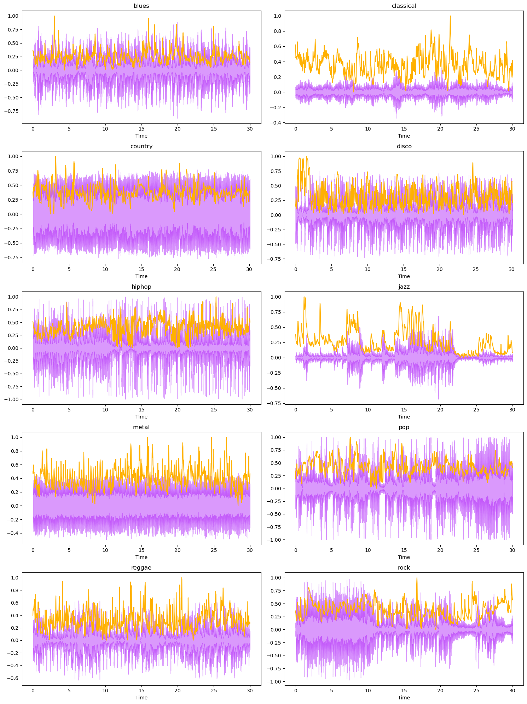

# PORTFOLIO

## Recommender system

[Movie Recommender System](https://github.com/mju-git/movie-recommender)

Content based movie recommender system as a Streamlit app. 
Data scrapping from the IMDb and The Movie Database API. 
Using TF-IDF on curated movie metadata.  

  

## Classification

[Music Genre Classification](https://github.com/mju-git/Music-Genre-Classification)

Classifying audio files in genres they belong to based on extracted audio data. Using GTZAN dataset with 1000 files divides in 10 music genres. Testing on variety of classification algorithms. Achieved 91% accuracy with CatBoostClassifier. Extracting audio data and creating visualizations as a base for deep learning model. Next steps include music recommender system based on detailed audio data.

[Digit Recognition](https://github.com/mju-git/MNIST)

Classification of the hand 70000 hand written digits. Achieved 97% accuracy with KNN algorithm. Next steps include deep developing neural network models. 

  

## Regression

[House price prediction](https://github.com/mju-git/housing-prices)

Building a regression model from a dataset of house prices in state of California. Model should predict median house price based on several dataset features using random forest regressor algorithm. Lowest achieved RMSE is 46910 with 95% confidence interval of [44945, 48797].

  

## Text analysis

[Telegram chat analysis](https://github.com/mju-git/chat-analysis)

Exploratory data analysis and visualization of private Telegram chat with 700000 messages.

